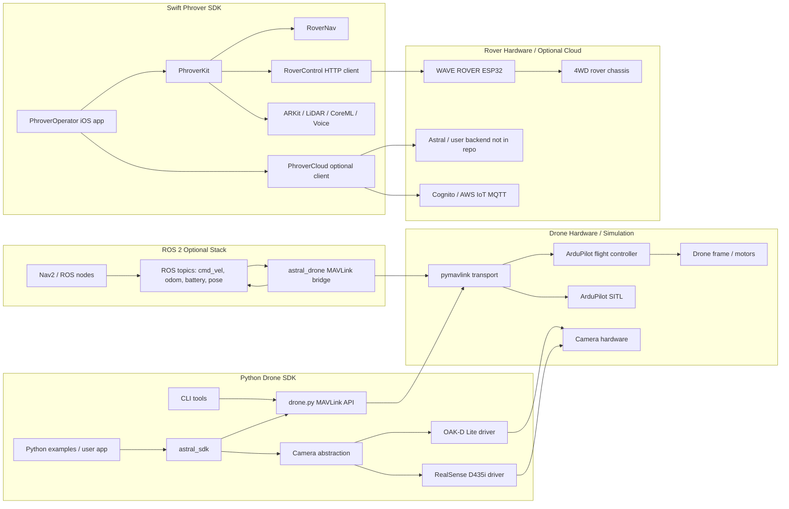
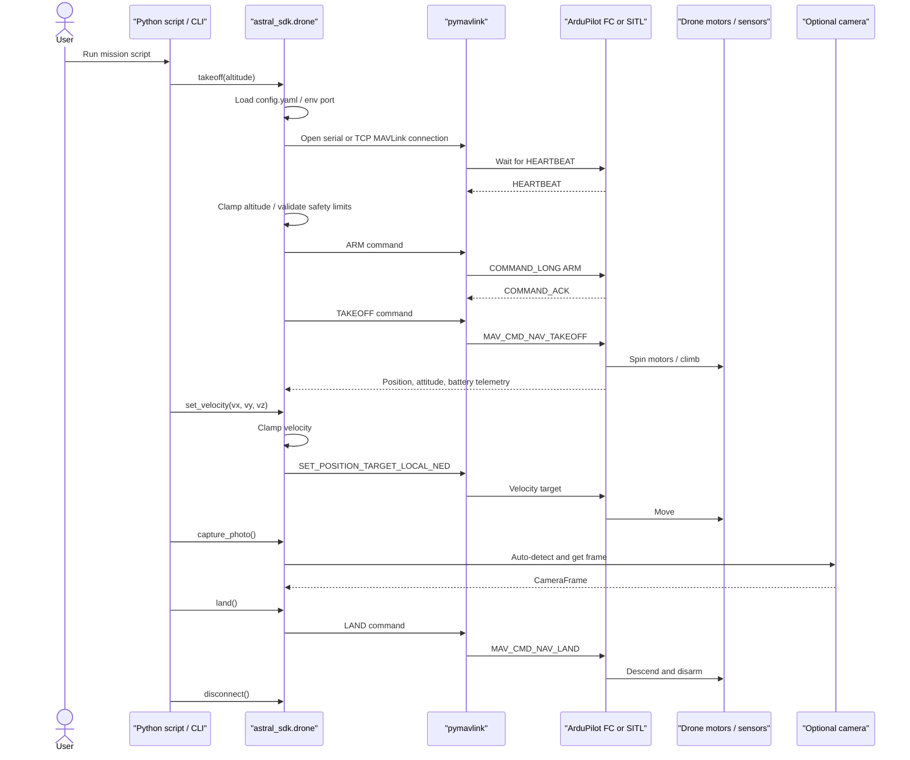
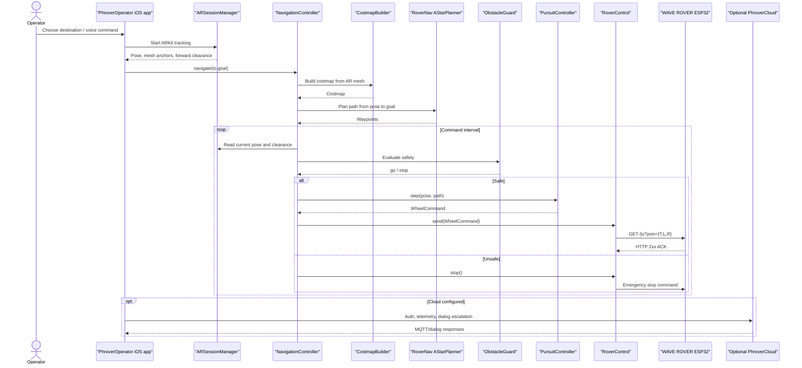

# Astral SDK Component and Sequence Diagrams

This document shows how the main components in `astral-sdk` fit together and how the two primary runtime flows work.

## Component Diagram

## Drone Command Sequence

## Phrover Rover Sequence

