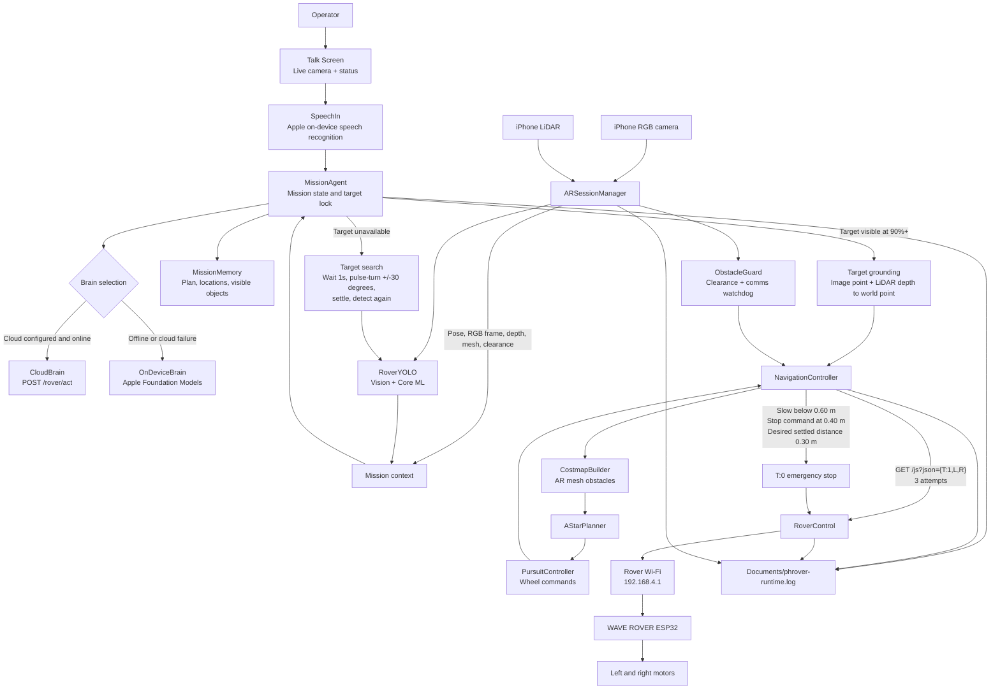
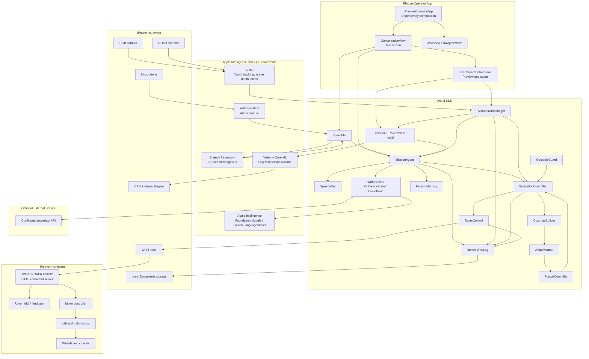
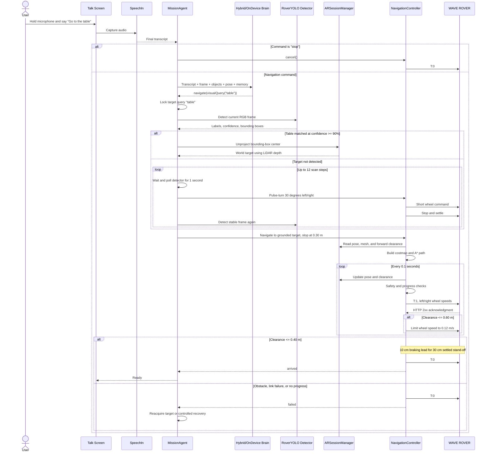

# Phrover Fixes - July 7, 2026 PDT

This document summarizes the issues we investigated and the fixes committed on branch
`fix/speech-recognition`. The pulled phone logs use UTC timestamps, so several log entries
appear as July 8, 2026 UTC.

## Current Branch

- Branch: `fix/speech-recognition`
- Base before this workstream: `main` at `c2e8cf5`
- Latest fix commit: `39e6bba Reset on-device brain session per decision`
- Latest uncommitted update: runtime mission logging, rover command failure handling,
  app-start feedback enablement, wider LiDAR clearance sampling, requested-object scan
  locking, rover command retry handling, a less brittle comms watchdog, and post-turn
  detector polling during visual-target scan.

## Pulled Logs

- First app document pull:
  `/private/tmp/phrover-documents-20260707-2209/phrover-brain-errors.log`
- Later app document pull for busy-thinking behavior:
  `/private/tmp/phrover-documents-20260708-busy-thinking/phrover-brain-errors.log`
- Latest app document pull after the "thinking too long / On it..." report:
  `/private/tmp/phrover-documents-20260708T055900Z`
- App document pull for the repeated `Thinking...` / `On it...` blinking report:
  `/private/tmp/phrover-documents-20260708-voice-blink/phrover-runtime.log`
- App document pull for the clear-hallway `Forward clearance: 0.35 m` report:
  `/private/tmp/phrover-documents-20260708-hallway-clearance/phrover-runtime.log`
- Latest app document pull for voice command doing nothing / comms lost:
  `/private/tmp/phrover-documents-20260708-latest/phrover-runtime.log`
- Latest app document pull for blocker recovery rotating too much:
  `/private/tmp/phrover-documents-20260708-latest-4/phrover-runtime.log`
- Latest app document pull for repeated blocker selection after recovery:
  `/private/tmp/phrover-documents-20260708-current/phrover-runtime.log`
- Latest app document pull for target-object drift and scan behavior:
  `/private/tmp/phrover-documents-20260708-target-scan/phrover-runtime.log`
- Follow-up app document pull for continued target-search behavior on July 9, 2026 PDT
  could not complete because the plugged-in iPhone was listed as `unavailable` by
  CoreDevice. The attempted destination was
  `/private/tmp/phrover-documents-20260709-target-scan-followup`.
- App document pull for valid target detection followed by rover command-link loss:
  `/private/tmp/phrover-documents-20260709-retry-log-pull/phrover-runtime.log`
- App document pull for stop/visible-none/target-direction behavior:
  `/private/tmp/phrover-documents-20260709-stop-visible-direction/phrover-runtime.log`
- App document pull for recognized refrigerator command followed by false command-link loss:
  `/private/tmp/phrover-documents-20260709-latest-pull/phrover-runtime.log`
- App document pull for visual-target arrival followed by an unnecessary second brain
  decision:
  `/private/tmp/phrover-documents-20260709-after-commit-pull/phrover-runtime.log`
- App document pull for slow camera/object-detection behavior after scan turns:
  `/private/tmp/phrover-documents-20260709-camera-slow/phrover-runtime.log`

Key log findings:

- `2026-07-08T03:45:01Z` and `2026-07-08T03:45:46Z` showed
  `FoundationModels.LanguageModelSession.GenerationError`:
  `Attempted to call respond(to:) a second time before the model finished responding to the previous prompt.`
- `2026-07-08T05:25:11Z`, `05:25:34Z`, `05:26:02Z`, and `05:27:13Z` showed
  `FoundationModels.LanguageModelSession.GenerationError`:
  `Exceeded model context window size`.
- Several later entries also showed nav state:
  `failed: Rover command link lost.`
- The latest app document pull succeeded but contained no files. That means the installed
  app did not have a pullable `phrover-brain-errors.log` or runtime log at that moment.
  A new general runtime log was added after this pull so future device pulls should include
  `Documents/phrover-runtime.log`.
- The exact phrase `Sorry, I am busy thinking right now` was not found in the pulled file log or current source. The current committed busy response is:
  `I'm still working on the previous command. Say stop if you want me to cancel it.`
- The `Thinking...` / `On it...` blinking report was reproduced in the runtime log:
  - `2026-07-08T15:31:25Z` received `Go to the black chair in the other room`.
  - Every attempted action immediately hit `nav_safety_stop clearance=0.36 reason=obstacle`.
  - After each failed motion, the mission loop asked the brain for another action instead of
    ending the mission, so it repeated until tick 24 and then finished.
  - There was no `phrover-brain-errors.log` in this pull, so this was mission-control behavior,
    not a FoundationModels crash.
- The hallway pull showed the same LiDAR safety value on real hardware:
  - Forward clearance stabilized around `0.34` to `0.35 m` while tracking was `normal`.
  - `2026-07-08T15:58:32Z` received `Go to the black chair in the room`.
  - Navigation immediately stopped with `nav_safety_stop clearance=0.35 reason=obstacle`.
  - That confirmed the app was not showing stale UI; the clearance calculation was reporting
    a near depth sample in the driving corridor.
- The latest pull showed two more voice/navigation issues:
  - `2026-07-08T16:58:32Z` logged `voice_command_received utterance=` with an empty
    transcript, and the app still started a mission.
  - `2026-07-08T16:58:54Z` received `Go to the table and come back`, clearance was about
    `1.17 m`, but navigation immediately stopped with `nav_safety_stop reason=comms_lost`.
  - The code checked the rover comms watchdog before sending the first command for a new
    navigation attempt, so an old successful command ack could expire while the rover was
    idle and then block the next voice command before it moved.
- The blocker-recovery pull showed the mission did receive and act on the target command:
  - `2026-07-08T18:54:52Z` received `Go to the table and back`.
  - `2026-07-08T18:55:45Z` stopped with `Obstacle ahead at 0.20 m.`
  - The next line logged `mission_blocked_heading ... recovery=rotate_90deg`.
  - After that, no new `mission_thinking` or `mission_decision` entries appeared until
    the operator said `Stop` at `2026-07-08T18:56:53Z`. That means the mission was stuck
    waiting for the recovery rotation instead of returning to object search.
- The latest repeated-blocker pull showed the 30-degree recovery was installed and working,
  but the mission could still choose a blocked opening again:
  - `2026-07-08T22:19:20Z` received `Go to the oranges`.
  - `2026-07-08T22:20:08Z` stopped at `Obstacle ahead at 0.26 m.`, logged
    `mission_blocked_heading ... recovery=rotate_30deg`, then timed out the recovery turn.
  - The mission returned to `mission_thinking`, but later picked another blocked exploration
    candidate and repeated until a rover command timed out. That means blocked openings were
  still being presented as selectable unexplored candidates after recovery.
- The target-scan pull showed the object detector was loaded, but the mission did not keep
  the operator's requested object locked:
  - `2026-07-08T23:57:23Z` and `2026-07-09T00:00:09Z` logged
    `detector_loaded resource=RoverYOLO.mlmodelc`.
  - `2026-07-09T00:05:15Z` received `Go to the refrigerator` and first decided
    `navigate(visualQuery(the refrigerator))`.
  - At `2026-07-09T00:07:25Z`, while still in the same mission, the brain changed the target
    to `navigate(visualQuery(the green chair))`.
  - The mission then alternated between refrigerator, green refrigerator, green chair, and
    exploration decisions while repeatedly hitting `Obstacle ahead` stops.
  - `2026-07-09T00:09:01Z` received another `Go to the refrigerator`, but after the first
    blocked motion the next decision was `explore(opening_6)` instead of continuing a
    deliberate scan for the requested refrigerator.
- The July 9 follow-up pull could not retrieve a fresh runtime log:
  - `xcrun devicectl list devices` showed `iPhone ... unavailable`.
  - `xcrun devicectl device copy from ... --domain-identifier us.astral.phrover` failed
    with CoreDevice error `1011`, `unable to locate a device matching the requested device identifier`.
  - Code review of `MissionAgent` showed the same likely failure mode: unresolved visual
    targets rotated once, then the mission asked the brain again. If that second brain result
    was `.done` or drifted to another action, the rover stopped searching for the requested object.
- The latest July 9 pull showed the voice, detector, and target-lock path working before the
  rover command link dropped:
  - `2026-07-09T17:31:20Z` received `Go to the refrigerator`.
  - The same tick logged visible objects `refrigerator:0.99,bowl:0.88`.
  - `2026-07-09T17:31:24Z` decided `navigate(visualQuery(the refrigerator))`, locked
    `the refrigerator`, and matched it at `0.97` confidence.
  - Clearance stayed near `1.0 m` or more until `2026-07-09T17:31:53Z`, when navigation
    logged `nav_safety_stop reason=comms_lost` and settled as
    `failed: Rover command link lost.`
- The latest command-link pull showed a false-positive comms watchdog stop:
  - `2026-07-09T18:57:26Z` received `Go to the refrigerator`.
  - `2026-07-09T18:57:30Z` locked and matched `the fridge` at `0.97` confidence.
  - From `2026-07-09T18:57:30Z` through `18:59:30Z`, `nav_drive_tick` logged goal, pose,
    distance-to-goal, and wheel commands while `rover_command_request` entries returned
    `status=200`.
  - At `2026-07-09T18:59:32Z`, navigation still logged `nav_safety_stop reason=comms_lost`,
    which means the old `0.5s` watchdog was too tight for brief command-loop gaps even when
    recent rover HTTP requests were succeeding.
- The stop/visible-none/target-direction pull showed three separate mission-control bugs:
  - `2026-07-09T18:04:25Z` logged `rover_command_retry attempt=1` followed by
    `nav_command_failed error=The request timed out`, confirming the retry path ran but
    the rover still did not respond within the timeout.
  - The command targeted `the fridge`, but repeated logs showed
    `mission_target_not_locked ... visible=refrigerator:0.99...`, proving the target matcher
    did not treat `fridge` and `refrigerator` as the same object.
  - `2026-07-09T18:04:59Z`, `18:05:26Z`, and `18:05:45Z` logged stop commands, but the same
    mission continued to log target-scan activity afterward. Stop invalidated motion but did
    not cancel the active visual-target scan loop.
  - Around `2026-07-09T18:05:27Z` through `18:05:29Z`, the app repeatedly logged
    `visible=none`, but the scan loop continued to rotate. This made the rover keep operating
    even though the camera/detector had no object to track.
- The latest July 9 pull showed a completed visual-target approach being treated as an
  unfinished mission:
  - `2026-07-09T22:16:37Z` received `Go to the refrigerator`.
  - `2026-07-09T22:16:41Z` matched `refrigerator` at `0.99` confidence with
    `direction=left`, then started navigation to the grounded point.
  - From `2026-07-09T22:16:41Z` through `22:17:27Z`, `rover_command_request` entries
    returned `status=200`, so this was not a rover HTTP transport failure.
  - `2026-07-09T22:17:27Z` logged `nav_safety_stop clearance=0.34 reason=obstacle
    state=arrived` and `motion_settled state=arrived`.
  - Immediately after that, the same mission logged another `mission_thinking` and a second
    `mission_decision navigate(visualQuery(the refrigerator))`, then stopped because
    `visible=none`. The direct visual-target path did not treat `.arrived` as terminal.
- The camera-slow pull showed the device app was not yet running all local fixes, but also
  confirmed the detector timing risk in the local scan code:
  - The pulled log still contained `mission_visible_none_stop`, which the local code had
    already removed, so the installed iPhone build was behind this branch.
  - `2026-07-09T22:57:47Z` received `Go to the refrigerator`.
  - `2026-07-09T22:57:51Z` matched `refrigerator` at high confidence and started visual
    navigation, proving the camera/detector path can work when the target is in frame.
  - Local code review found that after each 30-degree scan turn, `MissionAgent` could check
    the detector immediately against a stale frame. If the next camera/detector result
    arrived a few milliseconds later, the scan could miss it and give up too early.

## Issues And Fixes

| Issue | Evidence / Symptom | Fix | Commit |
| --- | --- | --- | --- |
| Speech recognition crashed due to Swift concurrency queue isolation. | LLDB showed `_dispatch_assert_queue_fail` in `SpeechIn.requestAuthorization` and audio tap callbacks. | Moved speech authorization/audio callbacks onto the expected actor-safe path. | `d9db314 Fix speech recognition concurrency crashes` |
| App signing failed with invalid Speech Recognition entitlement. | Xcode reported `com.apple.developer.speech-recognition not found and could not be included in profile`. | Removed the invalid entitlement so the app can be signed with the available profile. | `e4c6891 Remove invalid speech signing entitlement` |
| Direct voice drive commands did not consistently send the expected rover commands. | Voice command path recognized simple commands but did not reliably drive the rover. | Added direct command handling for drive-style commands. | `dc37063 Fix direct voice drive commands` |
| Interpreted voice rotation did not turn correctly. | User saw `Turn left` but the rover did not rotate as expected. | Added rotation command handling and tests for left/right wheel directions. | `35b8e39 Fix interpreted voice rotation` |
| Talk screen status stayed `ready` even while a command was being processed. | UI showed the command text but did not show that the brain was thinking or acting. | Wired mission phase changes into the conversation UI so status can show processing state. | `0073059 Show voice command processing status` |
| Speech recognition could start handling a command before recognition fully finished. | Voice flow could overlap speech capture and command handling. | Changed `SpeechIn` and `ConversationView` so command handling begins after final recognition. | `43b1756 Finish speech recognition before handling command` |
| If the requested object was not visible, the rover did nothing useful. | User expected requests like chair/table to search if not detected. | Added mission behavior to explore known frontiers or rotate in place when a visual target cannot be grounded. | `1773ed5 Search when requested object is not visible` |
| Brain failures were hard to diagnose after testing on the iPhone. | There was no durable app-side brain error file to pull from the phone. | Added `BrainErrorFileLog` writing detailed context to `Documents/phrover-brain-errors.log`. | `0839d1f Log brain errors to app documents` |
| Stop voice command did not work while the brain was unavailable or busy. | Stop could still require a valid pose/brain path, so it could be blocked by the same failure. | Made emergency stop bypass missing pose and brain errors, directly canceling motion. | `482a0dc Bypass brain for voice emergency stop` |
| Multiple voice commands could enter the brain at the same time. | FoundationModels logged `Attempted to call respond(to:) a second time before the model finished responding`. | Added mission-generation tracking so only one normal mission is handled at once, while stop invalidates the in-flight mission. | `f86c85e Fix voice command and navigation safety handling` |
| LiDAR obstacle handling could keep the rover in a driving loop. | When LiDAR detected an obstacle, the code sent `stop()` but then slept and continued the loop. The app stayed busy instead of becoming ready. | On obstacle, the navigation loop now stops and exits. If the obstacle is near the target, state becomes `.arrived`; if it is a wall/early obstacle, state becomes `.failed(...)`. | `f86c85e Fix voice command and navigation safety handling` |
| Cancel did not always return nav state to ready/idle. | `NavigationController.cancel()` stopped motors but did not update `state`. | `cancel()` now sets navigation state to `.idle`. | `f86c85e Fix voice command and navigation safety handling` |
| On-device brain eventually failed with `Exceeded model context window size`. | Pulled logs at `2026-07-08T05:25:11Z` through `05:27:13Z` showed the context-window error. | `OnDeviceBrain` now creates a fresh FoundationModels session/responder for every decision instead of reusing one growing session. | `39e6bba Reset on-device brain session per decision` |
| Talk could blink between `Thinking...` and `On it...` without anything happening. | The navigation loop used `try? await control.send(...)`, so rover HTTP failures were swallowed and nav could remain `.driving` forever. | Command send failures now stop the rover best-effort, set nav state to `.failed("Rover command failed: ...")`, exit the motion loop, and write `nav_command_failed` to the runtime log. | Uncommitted |
| Talk could behave differently after switching to Drive view. | `DriveView` enabled rover feedback flow, but Talk/Navigate could run before that view was opened. | App startup now enables feedback flow once and records `feedback_flow_enabled` or `feedback_flow_failed` in `Documents/phrover-runtime.log`. | Uncommitted |
| Forward clearance could display incorrectly and miss walls. | The previous LiDAR safety value sampled only the center 20% of the depth map and used raw `sceneDepth`. A wall slightly off the phone's center line could be missed. | AR now requests `smoothedSceneDepth` when available, prefers it over raw depth, samples a wider driving corridor, and logs `forward_clearance` about once per second. | Uncommitted |
| Phone pulls did not show why voice commands stalled unless the brain threw an error. | The existing pullable log only captured brain exceptions, not normal mission state transitions or nav command failures. | Added `RuntimeFileLog` writing `Documents/phrover-runtime.log` with voice command, thinking, decision, motion-settled, feedback-flow, nav-failure, and clearance events. | Uncommitted |
| Voice command was received but Talk blinked between `Thinking...` and `On it...` with no rover motion. | Runtime log showed the mission repeatedly deciding `explore(opening_1)` / `navigate(...)`, then immediately settling to `failed: Obstacle ahead at 0.36 m.`, then asking the brain again. | `MissionAgent` now treats navigation `.failed(...)` as terminal for the current mission: it speaks the failure reason, logs `mission_motion_failed`, returns to idle, and stops asking the brain for more actions. | Uncommitted |
| Clear hallway reported `Forward clearance: 0.35 m`. | Pulled runtime log showed stable `forward_clearance meters=0.34/0.35 tracking=normal`, and the mission stopped with `Obstacle ahead at 0.35 m.` even though the hallway photo looked clear. The previous algorithm returned the single nearest valid depth sample, so floor, side-wall, mount, or depth noise outliers could pin the clearance. | `forwardClearance(fromDepthMap:)` now returns a low percentile of valid driving-corridor depth samples instead of the absolute minimum. A real nearby obstacle cluster still stops the rover, but a single near outlier no longer makes a clear hallway look blocked. | Uncommitted |
| Empty speech result started a mission. | Latest runtime log had `voice_command_received utterance=` followed by `mission_thinking` and an explore decision. | `MissionAgent.handle` now trims utterances and ignores blank speech results before logging them as received or invoking the brain. | Uncommitted |
| Voice command did nothing because navigation immediately reported `Rover command link lost.` | Latest runtime log showed a valid command with clear forward clearance, then `nav_safety_stop reason=comms_lost` before any command-failure detail. The watchdog compared the current time to an old `lastAckAt` from before the new mission. | Navigation now ignores stale acks until the current drive/rotate loop has successfully sent its first command. After that first send, the comms watchdog remains active. | Uncommitted |
| After hitting a blocker, the rover rotated too much and could not keep searching for the requested object. | Latest runtime log showed `mission_blocked_heading ... recovery=rotate_90deg`, then no new mission decisions until the operator said `Stop` 68 seconds later. The mission was waiting inside the recovery turn instead of returning to the brain/perception loop. | Blocked-heading recovery now uses a short `30°` scan turn instead of `90°`, bounds that recovery with a timeout, cancels it if it does not settle, and logs `mission_blocked_heading_recovery_settled` or `mission_blocked_heading_recovery_timeout`. | Uncommitted |
| After recovering from a blocked opening, the brain could choose that same blocked opening again. | Latest runtime log showed `Go to the oranges`, then repeated `mission_blocked_heading ... recovery=rotate_30deg` and new `mission_decision explore(...)` loops. The 30-degree recovery returned control to the brain, but the blocked exploration candidate still had `unexplored` status. | When an `.explore(candidateId:)` motion is blocked, `MissionAgent` now marks that candidate `visited` before the next brain decision and logs `mission_exploration_candidate_blocked`. In this context, `visited` means checked/not worth choosing again. | Uncommitted |
| It was hard to tell whether the camera and object detector were working from the Talk screen. | The Drive/Navigate screens showed AR tracking and clearance, but Talk had no live camera preview or visible object labels. That made it unclear whether "go to the table" failed because speech, brain, camera frames, detector labels, or LiDAR grounding failed. | Talk now shows a small live camera preview with tracking, forward clearance, and top detected labels/confidence using the same detector instance that feeds `MissionAgent`. | Uncommitted |
| Talk showed `Visible: none` even while pointing at a chair. | The bundled CoreML metadata confirms the YOLO model includes COCO labels such as `chair` and `dining table`, so the label was not missing. The detector was only running Vision with one camera orientation, which can produce no observations even when the live preview is aimed correctly. | `Detector` now retries common Vision image orientations when the primary orientation returns no detections, logs detector failures by orientation, exposes load state, and Talk shows `Detector: loaded/unavailable` next to `Visible`. | Uncommitted |
| Requested-object search could stop after one scan turn. | Fresh logs could not be pulled because the iPhone was `unavailable`, but the mission code showed the unresolved visual target path rotated once and then asked the brain again. A `.done`, changed target, or explore decision could end the search before the detector found the requested object. | `MissionAgent` now waits up to 3 seconds for the requested visual target, then alternates 30-degree scan turns left/right inside the same command until the target is detected above the 90% threshold or scan steps are exhausted. When the target is found, it navigates to the grounded point and returns to ready instead of asking the brain to reinterpret the command. Runtime logs now include scan wait timeouts, scan steps, scan exhaustion, and visual-target navigation completion. | Uncommitted |
| Talk showed `Detector: unavailable`. | The built iPhone app bundle contains `RoverYOLO.mlmodelc`, but `Detector` only searched for `RoverYOLO.mlpackage`, so model initialization could fail before any object detection ran. | `Detector` now prefers the compiled `.mlmodelc` resource, falls back to `.mlpackage`/`.mlmodel`, and logs `detector_loaded` or `detector_unavailable` with the resource/error in `phrover-runtime.log`. | Uncommitted |
| Target-object commands could drift to a different object and explore before checking the requested target. | Latest runtime log showed `Go to the refrigerator`, then later `navigate(visualQuery(the green chair))` in the same mission, plus immediate `explore(opening_6)` after a refrigerator command. | `MissionAgent` now locks the first visual query for a mission, ignores later visual-query drift, requires a detector match at `0.90` confidence or higher before navigating to the object, and rotates in 30-degree scan steps for up to a full circle before falling back to opening exploration. Runtime logs now include visible labels/confidence, target-lock, target-match, target-miss, and target-scan-step events. | Uncommitted |
| Runtime log writes could fail in runners where the Documents directory was missing. | The iOS simulator test run printed `Runtime log write failed: The folder "phrover-runtime.log" doesn't exist.` | `RuntimeFileLog` and `BrainErrorFileLog` now create the parent Documents directory before writing, so pullable logs are more reliable across app/test containers. | Uncommitted |
| Object detection crashed or logged a GPU background permission error. | Device log showed `Insufficient Permission (to submit GPU work from background)` from `model0_main__Op2_MpsGraphInference` on the Apple A17 Pro GPU. That means CoreML/Vision was trying to submit Metal work while the app was backgrounded or winding down. | `Detector` now loads the CoreML model with `.cpuAndNeuralEngine`, excluding GPU execution so live preview or mission perception cannot submit forbidden background Metal command buffers. | Uncommitted |
| Talk stayed stuck after obstacle recovery with no new rover action. | Pulled `/private/tmp/phrover-documents-20260709-log-pull/phrover-runtime.log`. The latest run logged `voice_command_received utterance=Go to the refrigerator`, `mission_target_match confidence=1.00`, then `mission_blocked_heading_recovery_timeout`. After that it logged `mission_thinking ... objects=bed:0.93` but no later `mission_decision` before `Stop`, proving the brain decision call hung. | `MissionAgent` now enforces a brain-decision timeout. If `brain.nextAction` does not return, the mission logs `mission_brain_timeout`, speaks the thinking-error message, exits the loop, and returns to Ready instead of staying busy forever. | Uncommitted |
| Target was detected, but navigation later failed with `Rover command link lost.` | Pulled `/private/tmp/phrover-documents-20260709-retry-log-pull/phrover-runtime.log`. The command `Go to the refrigerator` was heard, the detector saw `refrigerator` at `0.99`, the target match was `0.97`, and clearance stayed mostly above `1 m`. Navigation failed later with `nav_safety_stop reason=comms_lost`, so the remaining failure was the HTTP command/heartbeat link to the rover. | `RoverControl` now retries transient URL transport failures once after a short backoff and writes `rover_command_retry` to `phrover-runtime.log`. It does not retry encoding failures, invalid responses, or rover HTTP server errors. | Uncommitted |
| Requested-object scan could stall when the target was out of view and detector output was empty. | The previous visible-none fix stopped immediately on empty detector output. That avoided blind movement, but it also meant commands such as `go to the chair` could stall if the requested object was just outside the current camera view. | `MissionAgent` now waits 1 second for detector output, then continues the same locked target search with slow stepped 30-degree left/right scan turns. Empty detector frames are no longer terminal during this scan; the rover gives the detector time to load new frames between steps and only gives up after the configured scan-step limit. | Uncommitted |
| Camera/object detection was not fast enough after a scan turn. | The camera-slow pull showed target detection can work, but local code could rotate and immediately check object detection before Vision/CoreML had produced a fresh frame for the new heading. In tests, a target appearing 20 ms after rotation was missed. | After every scan turn, `MissionAgent` now waits for the requested target instead of doing a single immediate check. The wait loop polls multiple times inside the scan-delay window, so a slightly delayed detector frame can lock the target and navigate without another brain decision. | Uncommitted |
| Stop command did not cancel an active requested-object scan immediately. | The same log showed `voice_command_stop` entries followed by continued `mission_target_not_locked` and `mission_target_scan_step` activity in the previous mission. | The visual-target scan loop now checks mission validity after each wait and after each rotate, returns `.cancelled`, and exits the mission instead of continuing after `stop`. | Uncommitted |
| Requested target direction was not explicit, and `fridge` did not match `refrigerator`. | The log showed target `the fridge` while visible labels included `refrigerator:0.99`, but no target lock happened. | Visual target matching now canonicalizes common aliases such as `fridge` to `refrigerator`, and target matches log `direction=left/ahead/right` plus normalized `x` so the app can explain which way the object is from the camera frame. | Uncommitted |
| After target lock, the rover command link timed out without enough movement telemetry to diagnose the path. | Pulled `/private/tmp/phrover-documents-20260709-current-analysis/phrover-runtime.log`. The app heard `Go to the refrigerator`, matched `refrigerator` at `0.99`, and logged `direction=left`, but later failed with `nav_command_failed error=The request timed out.` The log did not include goal point, pose, distance-to-goal, wheel command, or request status for each HTTP attempt. | Navigation now logs `nav_goal_start`, `nav_drive_tick`, `nav_rotate_tick`, and `nav_command_send_failed` with goal, pose, distance, wheel speeds, clearance, and command-failure count. `RoverControl` now logs every `rover_command_request` with request URL and HTTP status or transport error, sends `Connection: close` / `Cache-Control: no-cache` to avoid stale ESP32 HTTP connections, and allows 3 transient attempts before failing. | Uncommitted |
| Navigation reported `Rover command link lost` even though rover HTTP requests were succeeding. | Pulled `/private/tmp/phrover-documents-20260709-latest-pull/phrover-runtime.log`. The app heard `Go to the refrigerator`, matched the requested object at `0.97`, and logged many `rover_command_request` entries with `status=200`. Navigation later stopped with `nav_safety_stop reason=comms_lost` after the old `0.5s` watchdog saw a brief command-loop gap. | Raised the default comms watchdog from `0.5s` to `2.0s` so short planning/logging gaps do not false-stop a healthy link. Actual rover sends still retry and fail through `nav_command_failed` when the ESP32 does not respond. `nav_safety_stop` now logs `ack_age` so future pulls show exactly how stale the last successful ack was. | Uncommitted |
| Rover reached the requested object, then Talk re-entered `Thinking...` / `On it...` and did nothing useful. | Pulled `/private/tmp/phrover-documents-20260709-after-commit-pull/phrover-runtime.log`. The app heard `Go to the refrigerator`, matched the target at `0.99`, sent rover commands with `status=200`, and stopped near the object as `state=arrived`. The same mission then asked the brain for another decision and stopped with `visible=none`. | `MissionAgent` now treats simple direct `.visualQuery(...)` navigation that settles as `.arrived` as terminal: it logs `mission_target_navigation_done`, sets phase back to Ready/idle, and does not ask the brain for another decision. Multi-step commands like `come back` / `return` are allowed to continue after arrival. | Uncommitted |

## Commits In Order

| Commit | Local Time | Summary |
| --- | --- | --- |
| `d9db314` | 2026-07-07 11:15:44 PDT | Fix speech recognition concurrency crashes |
| `e4c6891` | 2026-07-07 12:27:57 PDT | Remove invalid speech signing entitlement |
| `dc37063` | 2026-07-07 13:01:23 PDT | Fix direct voice drive commands |
| `35b8e39` | 2026-07-07 13:10:54 PDT | Fix interpreted voice rotation |
| `0073059` | 2026-07-07 13:44:15 PDT | Show voice command processing status |
| `43b1756` | 2026-07-07 13:56:40 PDT | Finish speech recognition before handling command |
| `1773ed5` | 2026-07-07 14:42:59 PDT | Search when requested object is not visible |
| `0839d1f` | 2026-07-07 15:10:55 PDT | Log brain errors to app documents |
| `482a0dc` | 2026-07-07 17:28:13 PDT | Bypass brain for voice emergency stop |
| `f86c85e` | 2026-07-07 22:21:03 PDT | Fix voice command and navigation safety handling |
| `39e6bba` | 2026-07-07 22:37:21 PDT | Reset on-device brain session per decision |

## Verification Run During The Workstream

- `PhroverKitTests` passed after the navigation safety fix:
  27 tests, 0 failures.
- `OnDeviceBrainTests` passed after the fresh-session fix:
  1 test, 0 failures.
- Full `PhroverKitTests` passed after the latest fix:
  28 tests, 0 failures.
- `git diff --check` passed after the latest fix.
- After the latest uncommitted runtime/nav/LiDAR update, full `PhroverKitTests` passed:
  30 tests, 0 failures.
- After the latest uncommitted runtime/nav/LiDAR update, the sample app build passed:
  `PhroverOperator` simulator build, `CODE_SIGNING_ALLOWED=NO`.
- `git diff --check` passed after the latest uncommitted update.
- After the mission-stop-on-navigation-failure fix, the new regression test
  `MissionAgentTests.testStopsMissionWhenNavigationFails` first failed because the mission
  called the brain 3 times after navigation failed, then passed after the fix.
- After the mission-stop-on-navigation-failure fix, full `PhroverKitTests` passed:
  31 tests, 0 failures.
- After the mission-stop-on-navigation-failure fix, the sample app build passed:
  `PhroverOperator` simulator build, `CODE_SIGNING_ALLOWED=NO`.
- After the clear-hallway clearance fix, `UnprojectionTests.testForwardClearanceIgnoresSingleNearOutlierInDrivingCorridor`
  first failed because a single `0.35 m` sample controlled the result, then passed after
  the robust percentile sampling change.
- After the clear-hallway clearance fix, full `PhroverKitTests` passed:
  32 tests, 0 failures.
- After the clear-hallway clearance fix, the sample app build passed:
  `PhroverOperator` simulator build, `CODE_SIGNING_ALLOWED=NO`.
- `git diff --check` passed after the clear-hallway clearance fix.
- After the empty-utterance and stale-ack fixes, the new focused tests passed:
  `MissionAgentTests.testBlankUtteranceIsIgnored`,
  `NavigationSafetyTests.testStaleAckIsIgnoredUntilNavigationSendsFirstCommand`, and
  `NavigationSafetyTests.testStaleAckStopsActiveNavigationAfterFirstCommand`.
- For the blocker-recovery fix, the new focused regression first failed before production
  support because `blockedHeadingRecoveryTimeout` did not exist and the old code still used
  a fixed `90°` recovery.
- After the blocker-recovery fix, the focused iOS simulator tests passed:
  `MissionAgentTests.testRotatesAndContinuesWhenHeadingIsBlockedByObstacle` and
  `MissionAgentTests.testBlockedHeadingRecoveryCancelsScanTurnThatDoesNotSettle`.
- After the blocker-recovery fix, full `PhroverKitTests` passed on the iOS simulator:
  38 tests, 0 failures.
- After the blocker-recovery fix, the sample app build passed:
  `PhroverOperator` generic iOS build, `CODE_SIGNING_ALLOWED=NO`.
- `git diff --check` passed after the blocker-recovery fix.
- After the repeated-blocker fix, the new regression
  `MissionAgentTests.testMarksBlockedExplorationCandidateVisitedBeforeNextDecision` first
  failed because a blocked opening stayed `unexplored`, then passed after the fix.
- After the repeated-blocker fix, full `PhroverKitTests` passed on the iOS simulator:
  39 tests, 0 failures.
- After the repeated-blocker fix, the sample app build passed:
  `PhroverOperator` generic iOS build, `CODE_SIGNING_ALLOWED=NO`.
- `git diff --check` passed after the repeated-blocker fix.
- For the Talk camera debug panel, the new focused formatter tests first failed because
  `PerceptionDebugSummary` did not exist, then passed after the helper was added.
- After the Talk camera debug panel, full `PhroverKitTests` passed on the iOS simulator:
  41 tests, 0 failures.
- After the Talk camera debug panel, the sample app build passed:
  `PhroverOperator` generic iOS build, `CODE_SIGNING_ALLOWED=NO`.
- For the `Visible: none` chair issue, the new focused detector-orientation test first
  failed because `Detector.detectionOrientations` did not exist, then passed after adding
  orientation fallback.
- After the detector-orientation fallback, full `PhroverKitTests` passed on the iOS
  simulator: 42 tests, 0 failures.
- After the detector-orientation fallback, the sample app build passed:
  `PhroverOperator` generic iOS build, `CODE_SIGNING_ALLOWED=NO`.
- For the `Detector: unavailable` issue, the new focused resource test first failed because
  `Detector.modelResourceURL` did not exist, then passed after the loader started preferring
  the compiled `.mlmodelc` bundle.
- After the detector resource fix, full `PhroverKitTests` passed on the iOS simulator:
  43 tests, 0 failures.
- After the detector resource fix, the sample app build passed:
  `PhroverOperator` generic iOS build, `CODE_SIGNING_ALLOWED=NO`.
- For the target-lock scan fix, new focused MissionAgent regressions were added for
  30-degree visual-target scanning, ignoring below-90% matches, and keeping the original
  requested target when a later brain decision drifts to another object.
- After the target-lock scan fix, focused `MissionAgentTests` passed on the iOS simulator:
  22 tests, 0 failures.
- After the log-directory fix, focused `MissionAgentTests` passed again on the iOS simulator:
  22 tests, 0 failures, and the previous runtime-log write warnings were gone.
- After the target-lock scan fix, the sample app build passed:
  `PhroverOperator` generic iOS build.
- For the GPU background-permission issue, the new focused detector test first failed
  because `Detector.modelConfiguration` did not exist, then passed after the detector
  started excluding GPU compute.
- After the GPU background-permission fix, focused `DetectorTests` passed on the iOS
  simulator: 3 tests, 0 failures.
- After the GPU background-permission fix, the sample app build passed:
  `PhroverOperator` generic iOS build, `CODE_SIGNING_ALLOWED=NO`.
- For the post-obstacle thinking hang, the new focused regression first failed because
  `MissionAgent` had no `brainDecisionTimeout`, then passed after adding the timeout race.
- After the brain-timeout fix, focused `MissionAgentTests` passed on the iOS simulator:
  23 tests, 0 failures.
- For the 3-second requested-object scan fix, the new focused regression first failed because
  `MissionAgent` had no `visualTargetScanDelay`, then passed after the scan loop waited and
  alternated 30-degree scan turns inside the same command.
- After the requested-object scan fix, full `MissionAgentTests` passed on the iOS simulator:
  24 tests, 0 failures.
- After the requested-object scan fix, the sample app build passed:
  `PhroverOperator` generic iOS build, `CODE_SIGNING_ALLOWED=NO`.
- `git diff --check` passed after the requested-object scan fix.
- For the rover command retry fix, the new `RoverControlTests` regression first failed
  because a simulated `URLError(.timedOut)` was thrown immediately instead of retrying, then
  passed after `RoverControl` retried the transient transport failure.
- After the rover command retry fix, focused `RoverControlTests` passed on the iOS simulator:
  2 tests, 0 failures.
- After the rover command retry fix, full `PhroverKitTests` passed on the iOS simulator:
  51 tests, 0 failures.
- After the rover command retry fix, the sample app build passed:
  `PhroverOperator` generic iOS build, `CODE_SIGNING_ALLOWED=NO`.
- For the visible-none/stop/direction fix, the new focused MissionAgent regressions passed:
  `testStopsOperatingWhenNoObjectsAreVisibleForVisualTarget`,
  `testEmergencyStopCancelsActiveVisualTargetScanImmediately`, and
  `testFridgeAliasMatchesRefrigeratorAndDirectionIsDefined`.
- After the visible-none/stop/direction fix, full `PhroverKitTests` passed on the iOS
  simulator: 54 tests, 0 failures.
- After the visible-none/stop/direction fix, the sample app build passed:
  `PhroverOperator` generic iOS build, `CODE_SIGNING_ALLOWED=NO`.
- `git diff --check` passed after the visible-none/stop/direction fix.
- For the communication telemetry/reliability fix, focused `RoverControlTests` first
  failed because `RoverControl.requestLogFields` did not exist and two transient timeouts
  could not recover on the third attempt, then passed after adding request logging,
  no-cache/connection-close headers, and 3 transient attempts.
- For the navigation telemetry fix, the focused navigation test first failed because
  `NavigationController.driveTelemetryFields` did not exist, then passed after adding
  goal/pose/distance/wheel telemetry.
- After the communication telemetry/reliability fix, full `PhroverKitTests` passed on the
  iOS simulator: 58 tests, 0 failures.
- After the communication telemetry/reliability fix, the sample app build passed:
  `PhroverOperator` generic iOS build, `CODE_SIGNING_ALLOWED=NO`.
- `git diff --check` passed after the communication telemetry/reliability fix.
- For the comms-watchdog tuning, the new navigation safety regression first failed because
  the default watchdog stopped a 1.2 second command-loop gap, then passed after raising the
  default watchdog and adding `ack_age` diagnostics.
- After the comms-watchdog tuning, focused `NavigationSafetyTests` passed on the iOS
  simulator: 11 tests, 0 failures.
- After the comms-watchdog tuning, full `PhroverKitTests` passed on the iOS simulator:
  62 tests, 0 failures.
- After the comms-watchdog tuning, the sample app build passed:
  `PhroverOperator` generic iOS build, `CODE_SIGNING_ALLOWED=NO`.
- For the visual-target-arrival fix, the new regression
  `MissionAgentTests.testVisualTargetMissionStopsAfterArrival` first failed because the
  mission navigated twice and called the brain 3 times after arrival, then passed after
  simple direct visual-target arrival became terminal.
- The first full `PhroverKitTests` run after that change caught a regression in
  `MissionCognitionTests`: `go to the green chair ... then come back` stopped at the chair
  instead of returning. The fix was narrowed so follow-up intents such as `come back`,
  `return`, and `then` still continue through the brain after visual-target arrival.
- After narrowing the arrival guard, focused `MissionCognitionTests` plus
  `MissionAgentTests.testVisualTargetMissionStopsAfterArrival` passed:
  5 tests, 0 failures.
- After the final visual-target-arrival fix, full `PhroverKitTests` passed on the iOS
  simulator: 63 tests, 0 failures.
- After the final visual-target-arrival fix, the sample app build passed:
  `PhroverOperator` generic iOS build, `CODE_SIGNING_ALLOWED=NO`.
- For the slow stepped requested-object scan fix, the new regression
  `MissionAgentTests.testScansSlowlyWhenTargetIsOutOfViewAndNoObjectsAreVisible` first
  failed because no scan turn happened when detector output was empty, then passed after
  empty detector frames waited briefly and triggered 30-degree scan steps.
- After the slow stepped requested-object scan fix, full `PhroverKitTests` passed on the
  iOS simulator: 64 tests, 0 failures.
- After the slow stepped requested-object scan fix, the sample app build passed:
  `PhroverOperator` generic iOS build, `CODE_SIGNING_ALLOWED=NO`.
- For the camera/detector timing fix, the new regression
  `MissionAgentTests.testWaitsForDetectorAfterScanTurnBeforeGivingUp` first failed because
  the scan checked too early after rotation and missed a detector result that appeared
  20 ms later, then passed after the scan waited and polled after each turn.
- After the camera/detector timing fix, full `PhroverKitTests` passed on the iOS
  simulator: 65 tests, 0 failures.
- After the camera/detector timing fix, the sample app build passed:
  `PhroverOperator` generic iOS build, `CODE_SIGNING_ALLOWED=NO`.
- `git diff --check` passed after the camera/detector timing fix.
- The July 9 image follow-up (`IMG_5154.jpg`) showed the command text
  `Go to refrigerator`, but the live detector panel reported
  `Visible: orange 98%, orange 96%` and `Clearance: 0.46 m`. The requested
  refrigerator was not locked in the current frame, so driving toward any generic
  opening would be unsafe and could head toward the wrong object.
- For that requested-object lock fix, the MissionAgent behavior was changed so an
  unresolved visual target does not fall back to driving toward an exploration
  opening. It now keeps the visual command constrained to object-lock scanning and
  only navigates after the requested label matches the visible detector result at
  the configured confidence threshold.
- The scan turn sequence was also corrected. The old relative turn sequence
  `+30deg, -30deg` returned the rover to its starting heading instead of checking
  the opposite side. The new sequence starts `+30deg, -60deg, +60deg...`, so the
  camera actually samples both left and right of the original view in slow steps.
- Verification for the requested-object lock fix:
  - `swift test --filter MissionAgentTests` could not run in this environment because
    the package-level SwiftPM build compiles iOS-only ARKit/FoundationModels sources
    for macOS.
  - `xcodebuild -project examples/PhroverOperator/PhroverOperator.xcodeproj -scheme PhroverOperator -destination generic/platform=iOS build`
    passed.

### July 10: Visual target drive stalls and remains `On it...`

- The pulled device log showed that `Go to the refrigerator` initially matched a
  refrigerator at 99% and produced a fixed world goal 4.51 m away.
- The rover reduced the goal distance to about 1.92 m, then remained there for roughly
  2.5 minutes while sending `left=0.10, right=-0.10`. All rover requests were acknowledged,
  so this was not a Wi-Fi failure.
- That path-following turn speed was below the configured 0.25 minimum needed to overcome
  the WAVE ROVER drivetrain's static friction. The drive loop also had no no-progress
  deadline, so `MissionAgent` waited indefinitely and the Talk status remained `On it...`.
- Path-following in-place turns now enforce the configured 0.25 minimum wheel magnitude.
- Navigation now fails with `Navigation stalled.` if a commanded drive does not reduce its
  distance to the goal by at least 0.05 m within 2.5 seconds.
- A stalled visual-target mission now invokes the existing stepped scan sequence
  (`+30deg, -60deg, +60deg...`), waits for detector updates after each turn, and resumes
  navigation from the newly projected target position when confidence is at least 90%.
- If the scan is exhausted, the mission stops and returns to Ready instead of remaining
  in `On it...`.
- New runtime events are `nav_safety_stop reason=no_goal_progress`,
  `mission_visual_navigation_recovery`, `mission_target_reacquired`, and
  `mission_target_recovery_exhausted`.

### July 10: Target-search rotation sweeps past the object

- The pulled device log showed obstacle recovery rotating continuously at
  `left=-0.25, right=0.25`. In one 100 ms observation interval, yaw changed by about
  17 degrees. A 30-degree search step therefore exposed too few stable camera frames and
  could overshoot, reverse, and oscillate around the requested heading.
- The same log showed `mission_target_navigation_done` immediately after the blind
  obstacle-recovery turn. The requested refrigerator was not detected again and no fresh
  image point or world goal was calculated.
- Camera search now uses a separate slow rotation mode. It applies the drivetrain's
  required 0.25 wheel speed for an 80 ms pulse, sends stop, then waits 300 ms for ARKit and
  Core ML to settle before the next pulse.
- Scan turns use a 7-degree yaw tolerance. This prevents a small remaining heading error
  from causing another full minimum-speed pulse and overshooting the scan heading.
- A visual mission that stops on an obstacle now enters target reacquisition instead of
  treating a blind 30-degree turn as completion. It waits for detector updates, rejects
  matching detections below 90%, and only resumes after a matching detection at 90% or
  greater is unprojected into a fresh world goal.
- New scan telemetry includes `nav_rotate_tick mode=scan_pulse`,
  `nav_scan_turn_settle`, and `mission_visual_navigation_recovery`.
- Regression coverage:
  `MissionAgentTests.testBlockedVisualNavigationSlowlyScansUntilConfidentTargetIsReacquired`
  first failed because no slow scan or second navigation occurred. It passes after the
  fix and verifies that an 89% match is ignored while a later 95% match restarts navigation
  toward the newly calculated goal.
- After the slow target-search rotation fix, full `PhroverKitTests` passed on the iOS
  simulator: 67 tests, 0 failures.
- After the fix, the `PhroverOperator` generic iOS device build passed. The build retains
  the existing iOS 26 `UIScreen.main` deprecation and launch-configuration warnings.

### July 10: Pulsed scan still makes full rotations

- A second device log confirmed the 80 ms pulse and 300 ms settle commands were reaching
  the rover, but the heading controller was turning in the wrong direction. For a requested
  `+60deg` scan from `57deg` to `117deg`, the logical command
  `left=-0.25, right=0.25` moved measured ARKit yaw to `50deg`, then `6deg`, then
  `-36deg`. The error grew instead of shrinking and eventually wrapped around +/-180deg,
  causing repeated full rotations and limited ARKit tracking.
- The mismatch came from coordinate conventions: RoverNav uses mathematical CCW-positive
  yaw, while the current ARKit `x/world-z` ground plane reports the opposite physical turn
  sign for this WAVE ROVER mounting.
- `RoverControl.sendNavigation` now swaps logical left/right wheel values only for
  autonomous WAVE ROVER commands. Straight forward/reverse commands remain unchanged,
  angular navigation commands now move measured ARKit yaw toward the requested heading,
  and direct Drive-screen commands retain their physical left/right mapping.
- The new payload regression
  `RoverControlTests.testCommandMapsNavigationYawToWaveRoverWheelDirection` first failed
  with the old unswapped values and passed after the hardware-boundary conversion.
- `RoverControlTests.testManualCommandPreservesPhysicalWheelDirection` verifies the
  conversion does not reverse the Drive screen's left/right controls.
- After the turn-direction fix, full `PhroverKitTests` passed on the iOS simulator:
  69 tests, 0 failures. The generic iOS device build also passed.

### July 10: Visual target stops before reaching the requested stand-off

- The latest device log showed visual navigation stopping at `03:48:06Z` with
  `forward_clearance=0.42 m` and `distance_to_goal=0.99 m`. The general obstacle guard's
  0.45 m threshold marked the run as failed before the rover reached the requested object.
- Recovery then entered a stepped target scan. LiDAR clearance fell to 0.21-0.23 m, but
  scan rotation intentionally does not use the forward obstacle threshold, so the rover
  did not recognize this as target arrival and continued until the spoken `Stop` command.
- Visual-target navigation now carries a 0.30 m LiDAR stand-off distance from
  `MissionAgent` into `NavigationController`.
- The normal 0.45 m obstacle guard is relaxed only when the rover is within 1.20 m of the
  projected visual goal. Ordinary waypoint, exploration, and manual navigation keep the
  existing obstacle protection.
- At a forward clearance of 0.30 m or less, the controller immediately sends stop, marks
  navigation as arrived, and records `nav_target_reached` with clearance, goal distance,
  and configured stop distance.
- New regression coverage verifies that visual targets use the 0.30 m stand-off, that
  arrival occurs at the threshold, and that the relaxed approach behavior cannot activate
  when the projected target is farther than 1.20 m away.
- A follow-up device log showed the 0.30 m branch was executing, but the rover approached
  at about 0.35 m/s. Clearance changed from 0.33 m to 0.23 m during one 100 ms command
  cycle, the stop request returned HTTP 200, and the chassis then coasted to about 0.17 m.
  No drive requests were sent after `nav_target_reached`, so the remaining issue was
  final-approach overshoot rather than a missing stop decision or failed WiFi request.
- Locked visual-target navigation now caps proportional forward wheel commands at
  0.12 m/s once clearance is 0.60 m or less. At the 10 Hz command rate, this limits the
  nominal final advance to about 1.2 cm per cycle and gives the chassis time to settle near
  the 0.30 m stand-off. In-place turn commands are not capped because they require the
  existing minimum wheel speed to overcome drivetrain static friction.
- `nav_drive_tick` now records `target_approach_slowed=true` whenever this final-approach
  cap is active.
- The next physical run confirmed slowdown was active, but a stop issued at 0.29 m still
  settled at about 0.19 m. The app sent no later drive command and the `T=0` response was
  HTTP 200, confirming approximately 0.10 m of combined command, sensor, and chassis
  braking lag.
- Visual-target arrival now applies that measured 0.10 m brake lead: a requested 0.30 m
  stand-off sends stop at 0.40 m so the physical rover can settle near the requested
  distance. `nav_target_reached` logs both `stop_distance` and `brake_trigger_distance`
  for the next device validation.

## Current Implementation Diagrams

The diagrams below describe the implemented Phrover voice-to-motion path on branch
`fix/speech-recognition` after commit `03f4f1b`.

### Component Diagram

### Component Ownership Diagram

Only Foundation Models/SystemLanguageModel is an Apple Intelligence component. Speech,
AVFoundation, ARKit, Vision, and Core ML are Apple-provided iOS frameworks. The classes
that call those frameworks, including `SpeechIn`, `ARSessionManager`, and `Detector`, are
implemented in the Astral SDK.

### Voice Target Navigation Sequence

## Remaining Notes

- Older builds only wrote brain errors, not every spoken status message. That is why the
  exact busy-thinking phrase did not appear in the pulled log. The latest uncommitted
  update adds `Documents/phrover-runtime.log` for normal voice/navigation/LiDAR events.
- To analyze the next phone run, pull app Documents again and inspect:
  - `phrover-runtime.log`
  - `phrover-brain-errors.log`
- Remaining uncommitted files at the time this summary was written:
  - `docs/phrover-fixes-2026-07-08.md`
  - `swift/Sources/PhroverKit/Config/RoverConfig.swift`
  - `swift/Sources/PhroverKit/Nav/NavigationController.swift`
  - `swift/Sources/PhroverKit/RoverSDK/RoverControl.swift`
  - `swift/Sources/PhroverKit/Voice/MissionAgent.swift`
  - `swift/Tests/PhroverKitTests/MissionAgentTests.swift`
  - `swift/Tests/PhroverKitTests/NavigationSafetyTests.swift`
  - `swift/Tests/PhroverKitTests/RoverControlTests.swift`
